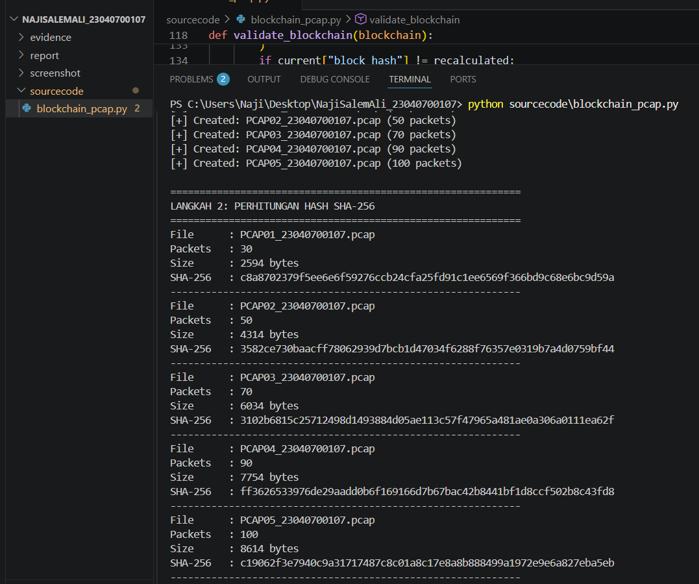
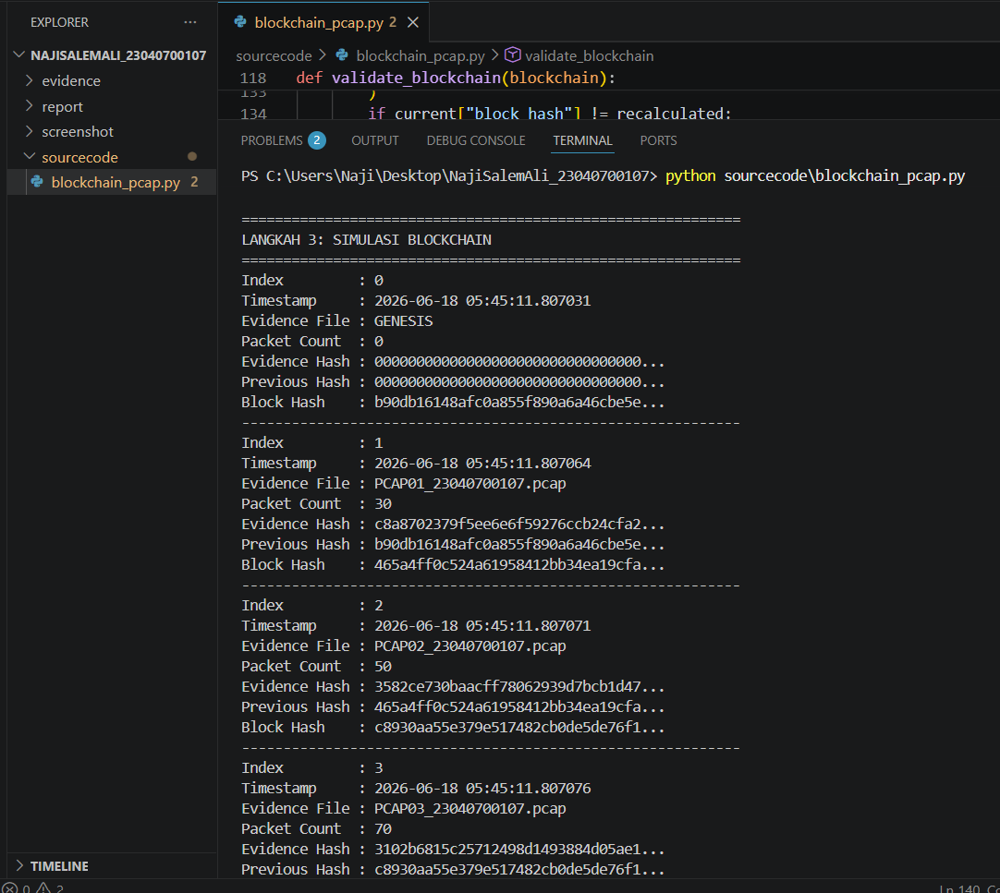
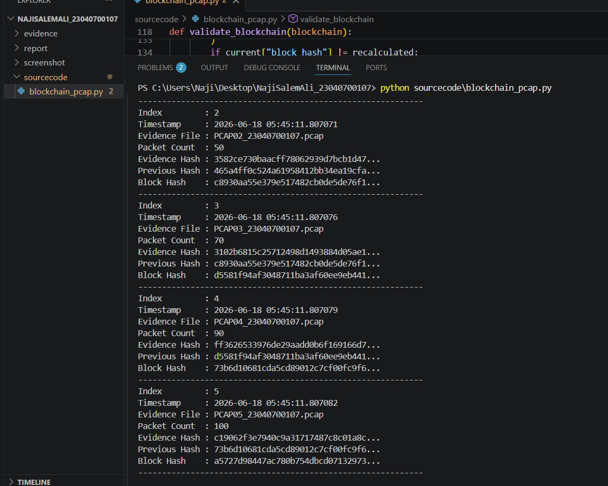
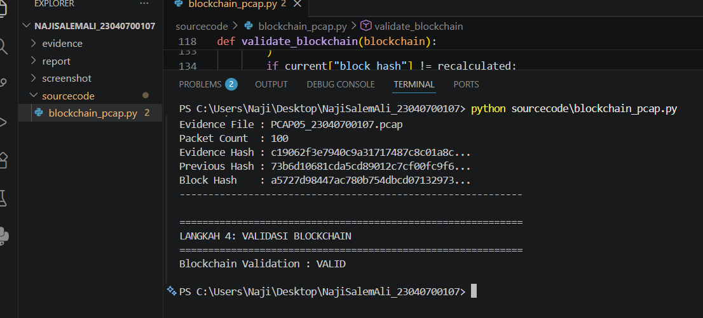
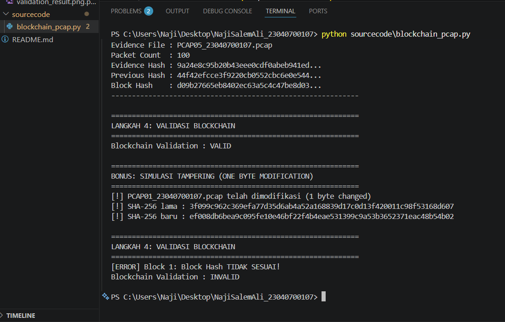

# Blockchain Pada Forensik Jaringan

Simulasi sistem blockchain untuk penyimpanan dan validasi hash bukti digital jaringan menggunakan Python. Sistem ini mengimplementasikan konsep chain of custody pada forensik digital dengan memanfaatkan SHA-256 dan struktur blockchain sederhana.

## Identitas Mahasiswa

Nama: Naji Salem Ali Alharethi
NIM: 23040700107
Jurusan: Teknik Informatika
Mata Kuliah: Blockchain
Session: 12 Blockchain pada Forensik Jaringan
Universitas: Universitas Muhammadiyah Jakarta

## Deskripsi Tugas

Program ini melakukan 4 tahapan utama dan 1 tahapan bonus.

1. Akuisisi Data Jaringan. Membuat 5 file PCAP menggunakan Scapy
2. Perhitungan Hash SHA-256. Menghitung hash setiap file PCAP sebagai identitas digital
3. Simulasi Blockchain. Membangun blockchain dengan 1 Genesis Block dan 5 Evidence Block
4. Validasi Blockchain. Memverifikasi integritas seluruh rantai blockchain
5. Bonus Tampering Test. Mensimulasikan modifikasi 1 byte untuk membuktikan deteksi blockchain

## Tools yang Digunakan

Python 3.14
Scapy 2.7.0
Hashlib (built-in)
VS Code
Wireshark
Git dan GitHub

## Struktur Repository

NajiSalemAli_23040700107/
evidence/
PCAP01_23040700107.pcap (30 paket)
PCAP02_23040700107.pcap (50 paket)
PCAP03_23040700107.pcap (70 paket)
PCAP04_23040700107.pcap (90 paket)
PCAP05_23040700107.pcap (100 paket)
sourcecode/
blockchain_pcap.py
screenshot/
hashing_result.png
blockchain_result_1.png
blockchain_result_2.png
validation_result.png
bonus_result.png
report/
laporan.pdf
README.md

## Penjelasan Kode Program

### 1. Akuisisi Data Jaringan create_pcap_files()

Membuat 5 file PCAP menggunakan Scapy. Setiap paket terdiri dari layer IP dan TCP dengan payload unik.

```python
def create_pcap_files():
    packet_counts = [30, 50, 70, 90, 100]
    for i, count in enumerate(packet_counts, 1):
        filename = f"PCAP{i:02d}_{NIM}.pcap"
        packets = []
        for j in range(count):
            pkt = IP(src=f"192.168.1.{j%254+1}", dst="10.0.0.1") / \
                  TCP(sport=1024+j, dport=80) / \
                  Raw(load=f"packet-{j}-evidence-{NIM}".encode())
            packets.append(pkt)
        wrpcap(filepath, packets)
```

Output adalah 5 file pcap dengan jumlah paket 30, 50, 70, 90, dan 100.

### 2. Perhitungan Hash SHA-256 calculate_sha256() dan hash_evidence_files()

Setiap file PCAP dibaca secara binary dan dihitung nilai hash SHA-256 nya.

```python
def calculate_sha256(filepath):
    sha256 = hashlib.sha256()
    with open(filepath, 'rb') as f:
        sha256.update(f.read())
    return sha256.hexdigest()
```

Fungsi hash_evidence_files() memanggil fungsi di atas untuk seluruh file dan menampilkan nama file, jumlah paket, ukuran file, dan nilai SHA-256.

### 3. Simulasi Blockchain calculate_block_hash() dan create_blockchain()

Setiap block dihitung hash nya dari gabungan seluruh atributnya.

```python
def calculate_block_hash(index, timestamp, evidence_file, packet_count, evidence_hash, previous_hash):
    data = f"{index}{timestamp}{evidence_file}{packet_count}{evidence_hash}{previous_hash}"
    return hashlib.sha256(data.encode()).hexdigest()
```

Blockchain dibangun dengan struktur berikut. Block 0 adalah Genesis Block yaitu block awal dengan hash bernilai nol. Block 1 sampai 5 adalah Evidence Block yang masing masing mewakili satu file PCAP dan terhubung melalui previous_hash.

Setiap block menyimpan 7 atribut yaitu Index, Timestamp, Evidence File, Packet Count, Evidence Hash, Previous Hash, dan Block Hash.

### 4. Validasi Blockchain validate_blockchain()

Fungsi ini memverifikasi dua hal untuk setiap block.

```python
def validate_blockchain(blockchain):
    for i in range(1, len(blockchain)):
        current = blockchain[i]
        previous = blockchain[i-1]
        
        if current["previous_hash"] != previous["block_hash"]:
            is_valid = False
        
        recalculated = calculate_block_hash(...)
        if current["block_hash"] != recalculated:
            is_valid = False
```

Output adalah Blockchain Validation VALID atau INVALID

### 5. Bonus Simulasi Tampering bonus_tamper_test()

Mensimulasikan serangan dengan mengubah 1 byte pada file PCAP01, kemudian membuktikan bahwa blockchain mendeteksi perubahan tersebut.

```python
def bonus_tamper_test(original_blockchain):
    with open(filepath, 'rb') as f:
        data = bytearray(f.read())
    data[100] = (data[100] + 1) % 256
    new_hash = calculate_sha256(filepath)
    
    tampered_blockchain = [block.copy() for block in original_blockchain]
    tampered_blockchain[1]["evidence_hash"] = new_hash
    validate_blockchain(tampered_blockchain)
```

Hasilnya hash berubah total karena Avalanche Effect, menyebabkan Blockchain Validation menjadi INVALID.

## Cara Menjalankan Program

Install dependencies dengan perintah berikut.

```bash
pip install scapy
```

Jalankan program dengan perintah berikut.

```bash
python sourcecode/blockchain_pcap.py
```

Program akan otomatis membuat 5 file PCAP di folder evidence, menampilkan hash SHA-256 setiap file, membangun dan menampilkan struktur blockchain, memvalidasi blockchain dengan hasil VALID, dan menjalankan simulasi tampering dengan hasil INVALID.

## Screenshot Hasil Eksekusi

### Hashing SHA-256


### Simulasi Blockchain Block 0 sampai 3


### Simulasi Blockchain Block 4 dan 5


### Validasi Blockchain


### Bonus Deteksi Tampering


## Hasil Validasi Blockchain
## Hasil Setelah Tampering Bonus
## Kesimpulan

Sistem ini berhasil membuktikan bahwa kombinasi SHA-256 dan Blockchain sangat efektif dalam menjaga integritas dan chain of custody bukti digital pada forensik jaringan. Perubahan sekecil 1 byte pada file bukti langsung terdeteksi oleh mekanisme validasi blockchain, menjadikan sistem ini andal untuk digunakan dalam investigasi forensik digital.